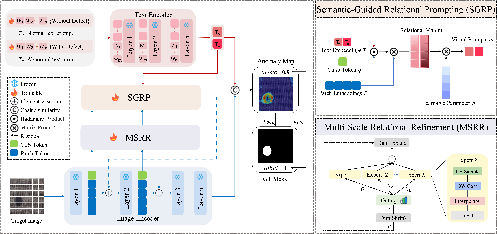

# ReMAP-AD

Official implementation of **"ReMAP-AD: Relation-guided Multi-scale Adaptive Prompting for Anomaly Detection"**.

ReMAP-AD is a CLIP-based framework for zero-shot and few-shot anomaly classification and segmentation. It keeps the CLIP backbone frozen and learns lightweight prompting/adaptation modules to convert local visual evidence into instance-adaptive prompts for fine-grained anomaly localization.

## News

- Code released for ReMAP-AD.
- Zero-shot training/evaluation and few-shot memory-bank inference are included.

## Overview

ReMAP-AD contains three main components:

- **Class-Agnostic Universal Prompt Learning (CAUPL)** learns transferable normal/abnormal state prompts, avoiding category-specific prompt engineering.
- **Multi-Scale Relational Refinement (MSRR)** enriches patch tokens with multi-scale structural cues through a lightweight mixture-of-experts refinement block.
- **Semantic-Guided Relational Prompting (SGRP)** grounds text semantics in local patch features and generates instance-adaptive visual prompts.

<p align="center">
  
</p>


## Installation

Create a Python environment and install the required packages. The code was developed for PyTorch-based CLIP training and evaluation.

```bash
conda create -n remap python=3.10 -y
conda activate remap

# Install PyTorch and torchvision according to your CUDA version:
# https://pytorch.org/get-started/locally/

pip install ftfy regex tqdm pandas scipy scikit-learn scikit-image opencv-python matplotlib seaborn pillow
```

The CLIP model weights are downloaded to `./download/clip/` by default when `main.py` or `test.py` first loads the backbone.

## Data Preparation

Place datasets under `./data`. The dataset loaders expect the following directory names:

```text
data/
+-- mvtec/
+-- visa/
+-- btad/
+-- DAGM_KaggleUpload/
+-- DTD-Synthetic/
+-- ISIC2016/
+-- CVC-ClinicDB/
+-- CVC-ColonDB/
+-- Kvasir/
+-- brainmri/
+-- br35h/
```

The zero-shot protocol follows the paper: train on one source industrial dataset and evaluate on unseen target datasets. For evaluation on MVTec AD, train on VisA; for evaluation on VisA and the other target datasets, train on MVTec AD.

## Training

Train on VisA and select the best checkpoint using MVTec:

```bash
CUDA_VISIBLE_DEVICES=0 python main.py \
  --log_dir ./train_log \
  --dataset visa \
  --test_dataset mvtec \
  --data_dir ./data \
  --epochs 40 \
  --best_ds mvtec
```

Train on MVTec and select the best checkpoint using VisA:

```bash
CUDA_VISIBLE_DEVICES=0 python main.py \
  --log_dir ./train_log \
  --dataset mvtec \
  --test_dataset visa \
  --data_dir ./data \
  --epochs 40 \
  --best_ds visa
```

## Citation

If this paper or repository is useful for your research, please cite:

```bibtex
@inproceedings{wu2026remapad,
  title     = {ReMAP-AD: Relation-guided Multi-scale Adaptive Prompting for Anomaly Detection},
  author    = {Wu, Peng and Liang, Hongyu and Chen, Yan and Wang, Xinye and Du, Liang},
  booktitle = {Proceedings of the conference},
  year      = {2026}
}
```

Please update the `booktitle` field with the official proceedings name once it is available.

## Acknowledgement

This implementation builds on CLIP-style vision-language anomaly detection research and related open-source projects such as WinCLIP, PromptAD, AnomalyCLIP, AdaCLIP, and AA-CLIP.
